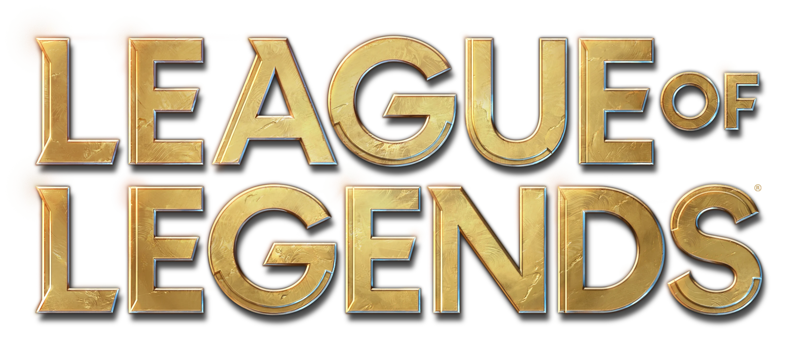
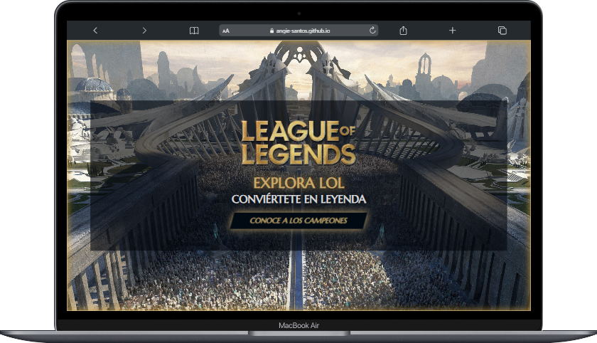
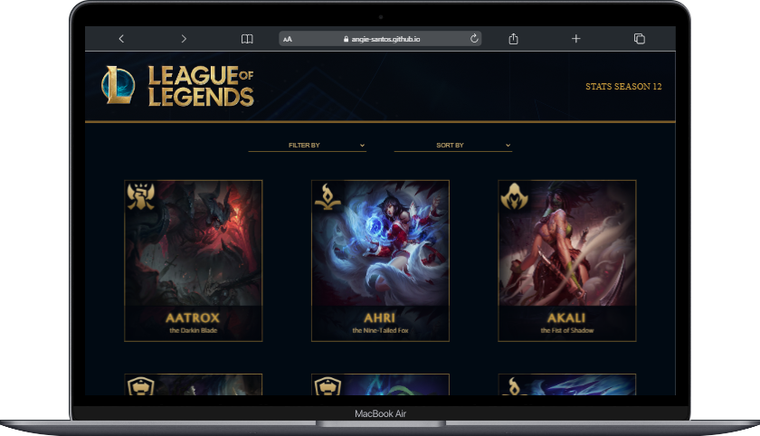
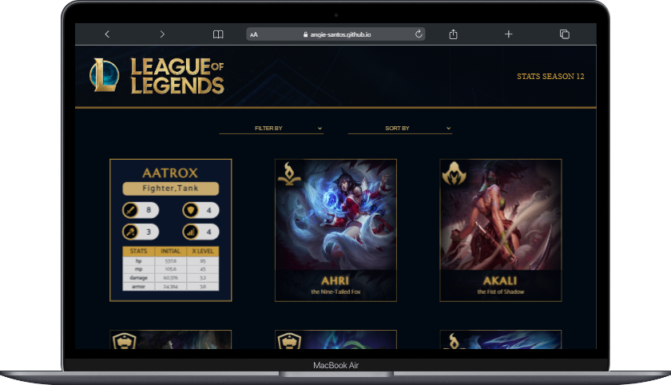
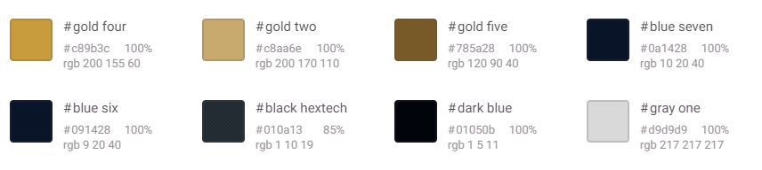

# CHAMPIONS - LOL

## Definición de producto

**Champions - LOL** es una aplicación web que almacena y permite visualizar a todos los campeones del videojuego League of legend, con sus principales características y habilidades, permite filtrar y ordenar la información para que los usuarios la consuman como deseen. 

### **¿A quién va dirigido?**

Champions - LOL va dirigido a jovenes-adultos que juegan LOL y quieren conocer más a fondo a los campeones.

### **¿Cuáles son los objetivos del usuario con relación al producto?**

La/el usuaria/o objetivo quiere poder ver a todos los campeones y conocer sus principales características.

### **¿Cómo el producto resuelve el problema del usuario?**

La página web recolecta la información de la api de la página oficial de LOL y muestra la información de manera clara y didáctica mediante cardflips, aparte permite filtrar y ordenar para que el usuario la consuma como desee. Como apartado adicional, para los más aficionados se muestra los niveles de habilidad de la temporada y se recomiendan algunos de los heroes más equilibrados. 

## Historias de Usuario

### Primera historia de usuario 1HU

Yo como usuario quiero visualizar los datos de los campeones para conocerlos

**Criterios de aceptación**

🛡️ El usuario llega a una pantalla de bienvenida que tiene un botón, al darle click llega a la pantalla  donde puede visualizar todos los campeones

🛡️ El usuario puede ver a los campeones organizados en cards/tarjetas

🛡️ Las tarjetas muestran la imagen del campeón, la imagen del rol el nombre y el titulo del campeón

🛡️ Las tarjetas están organizadas en orden alfabético

🛡️ La aplicación es visualmente agradable y la información es clara.

🛡️ No hay filtros, no hay botones solo la info básica de los campeones

🛡️ Se hace scroll desde el prime elemento hasta el último, no hay más páginas

**Definición de terminado**

⚔️ Prototipo de baja fidelidad

⚔️ Prototipo de alta fidelidad para mobile, tablet y pc

⚔️ Push a github

⚔️ test de usabilidad

⚔️ Es responsive para mobile, tablet y pc

### Segunda historia de usuario 2HU

Yo como usuario quiero visualizar los datos de los campeones para ver sus habilidades y estadísticas

**Criterios de aceptación**

🛡️ El usuario puede ver a los campeones organizados en cards/tarjetas

🛡️ Cuando el usuario le de click a una tarjeta, esta girará y podrá ver el nombre del campeón, su/s rol/es, información de poderes como ataque, defensa, magia, nivel y por último, habrá una tabla con las stats del personaje

🛡️ Se puede cliquear más de una tarjeta y estas quedarán activas a menos que el usuario de click sobre ellas de nuevo,

🛡️ La tarjeta volverá a su posición si le da click de nuevo

🛡️ La aplicación es visualmente agradable y la información es clara.

**Definición de terminado**

⚔️ Prototipo de baja fidelidad

⚔️ Prototipo de alta fidelidad para mobile, tablet y pc

⚔️ Push a github

⚔️ test de usabilidad

⚔️ Es responsive para mobile, tablet y pc

### Tercera historia de usuario 3HU

Yo como usuario quiero ordenar a los campeones por sus habilidades para ver quienes tienen más ataque, defensa, magia o dificultad

**Criterios de aceptación**

🛡️La lista desplegable se encuentra debajo del encabezado y encima de las tarjetas de los campeones

🛡️ El usuario puede dar click/tap a la lista desplegable y puede seleccionar ordenar en orden ascendente o descendente el ataque, la defensa, la magia y la dificultad

🛡️ Al dar click/tap a uno de los elementos de la lista desplegable, el usuario puede ver las tarjetas ordenadas según lo que seleccionó

🛡️ Solo hay una lista desplegable para ordenar

**Definición de terminado**

⚔️ Prototipo de baja fidelidad

⚔️ Prototipo de alta fidelidad para mobile, tablet y pc

⚔️ Push a github

⚔️ test de usabilidad

⚔️ Es responsive para mobile, tablet y pc

⚔️ Se crearon los test unitarios

⚔️ Se pasaron los test unitarios

### Cuarta historia de usuario 4HU

Yo como usuario quiero filtrar los datos de los campeones para clasificarlos por sus roles

**Criterios de aceptación**

🛡️ La lista desplegable se encuentra debajo del encabezado y encima de las tarjetas de los campeones.

🛡️ El usuario puede dar click/tap a la lista desplegable y puede seleccionar filtrar por los roles de los campeones (mago, asesino, tirador, soporte, tanque)

🛡️ Al dar click/tap a uno de los elementos de la lista desplegable, el usuario puede ver las tarjetas filtradas según lo que seleccionó

🛡️ En pantalla se visualizan 2 listas, una para ordenar y otra para filtrar

🛡️ Se puede solo filtrar

🛡️ Se puede filtrar y ordenar al tiempo

**Definición de terminado**

⚔️ Prototipo de baja fidelidad

⚔️ Prototipo de alta fidelidad para mobile, tablet y pc

⚔️ Push a github

⚔️ test de usabilidad

⚔️ Es responsive para mobile, tablet y pc

⚔️ Se crearon los test unitarios

⚔️ Se pasaron los test unitarios

### Quinta historia de usuario 5HU

Yo como usuario Quiero ver las estadísticas promedio de los campeones en la temporada para saber con que tipo de héroes es mejor jugar o saber como contratacar

**Criterios de aceptación** 

🛡️ Tiene un botón que dice stats season

🛡️ Al dar click al botón se abre un modal que indica el promedio de todos los campeones en cuanto a hp, mp, armor, spellblock, attackdamage.

🛡️ En el modal sólo se encuentra esta info

🛡️ Tiene un (X) para cerrarse y volvemos a la pantalla principal donde visualizamos los campeones

🛡️ La aplicación es visualmente agradable y la información es clara.

**Definición de terminado**

⚔️ Prototipo de baja fidelidad

⚔️ Prototipo de alta fidelidad para mobile, tablet y pc

⚔️ Push a github

⚔️ test de usabilidad

⚔️ Es responsive para mobile, tablet y pc

⚔️ Se crearon los test unitarios

⚔️ Se pasaron los test unitarios

### Sexta historia de usuario 6HU

Yo como usuario Quiero ver los campeones sugeridos en la temporada para probar sus cambios de habilidad

**Criterios de aceptación**

🛡️ El modal de las estadísticas tiene un botón que dice campeones sugeridos

🛡️ Al dar click al botón se despliega otro modal que dice los mejores (más equilibrados) campeones de la temporada según las estadísticas de la misma.

🛡️ En el modal sólo se encuentra esta info

🛡️ Tiene un (X) para cerrarse y volvemos a la pantalla principal donde visualizamos los campeones

🛡️ La aplicación es visualmente agradable y la información es clara.

**Definición de terminado**

⚔️ Prototipo de baja fidelidad

⚔️ Prototipo de alta fidelidad para mobile, tablet y pc

⚔️ Push a github

⚔️ test de usabilidad

⚔️ Es responsive para mobile, tablet y pc

⚔️ Se crearon los test unitarios

⚔️ Se pasaron los test unitarios

⚔️ Readme

⚔️ Publicación en github pages

## Diseño de la interfaz de usuario

### Prototipo de baja fidelidad

Link a [drive](https://photos.google.com/share/AF1QipOyoW42KJwhxJBRoms7-bc0aoNf-5Br9cDY4tLD99No1MkN_rUg8XMFwE2EKtRPtA?key=cHpJQTE3WS15Q09IeUQtRnVLSkM5UnhCQ2NEMG53)

### Prototipo de alta fidelidad

Link a [Figma](https://www.figma.com/proto/irZyFyQ2uPGWXnjjn72IEp/Project-Data-Lovers---LOL?page-id=0%3A1&node-id=141%3A47&viewport=-747%2C290%2C0.07&scaling=scale-down&starting-point-node-id=141%3A47)

Se usaron los colores y estilos base que recomiendan ellos para el manejo de [su marca](https://brand.riotgames.com/es-es/league-of-legends/fundamentals). 

**Colores**

**Fuentes**

- Marcellus, serif.
- Catamaran, sans.

## Test de usabilidad

Los test de usabilidad se aplicaron a personas cercanas que juegan LOL y a las compañeras. 

Las recomendaciones fueron las siguientes: 

- 1HU:
    - Agregar página de introducción para dar un contexto/bienvenida al usuario
    - Hacer el header más pequeño para dispositivos móviles.
- 2HU:
    - Cambiar los iconos de habilidad en la tarjeta de información, ya que no eran claros.
    - Cambiar fuente de la tabla de información por una sans.

para las demás historias no hubieron recomendaciones adicionales a parte de algunos ajustes en tamaño. 

⚔️ 🛡️⚔️ 🛡️⚔️ 🛡️⚔️ 🛡️⚔️ 🛡️⚔️ 🛡️⚔️ 🛡️⚔️ 🛡️⚔️ 🛡️⚔️ 🛡️⚔️ 🛡️⚔️ 🛡️⚔️ 🛡️⚔️ 🛡️